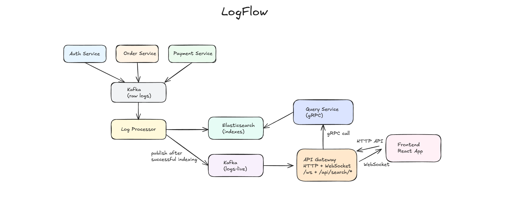

# LogFlow

LogFlow is a distributed log platform demo that generates logs from mock services, routes them through Kafka, indexes them in Elasticsearch, and exposes them in a React dashboard for live monitoring and historical search.

## What This Project Does

This project supports two main use cases:

1. Live log streaming to the frontend through WebSocket.
2. Historical log search through HTTP -> gRPC -> Elasticsearch.

The mock services currently covered are:

- `auth-service`
- `order-service`
- `payment-service`

## Architecture

Architecture flow:



[Project Walkthrough / Demo](https://drive.google.com/file/d/1WLmoh7zGybbAkQ_1HVyPyuRL_kSqpfQ9/view?usp=drive_link)

Editable source: [assets/diagram.excalidraw](assets/diagram.excalidraw)

The current architecture flow is:

1. `auth-service`, `order-service`, and `payment-service` publish raw logs to `Kafka (raw logs)`.
2. `log-processor` consumes raw Kafka messages.
3. `log-processor` indexes logs into `Elasticsearch (indexes)`.
4. After successful indexing, `log-processor` publishes the same event to `Kafka (logs-live)`.
5. `api-gateway` consumes `Kafka (logs-live)` and pushes live events to the frontend over `WebSocket /ws`.
6. The frontend calls `api-gateway` over HTTP for search operations.
7. `api-gateway` calls `query-service` over gRPC.
8. `query-service` reads from Elasticsearch and returns filtered search results.

## Data Flow

### Live logs

1. Mock services publish logs to `Kafka (raw logs)`.
2. `log-processor` consumes raw log topics.
3. `log-processor` indexes logs into Elasticsearch.
4. After successful indexing, `log-processor` publishes the same payload to `Kafka (logs-live)`.
5. `api-gateway` consumes `Kafka (logs-live)`.
6. `api-gateway` pushes those logs to WebSocket clients at `/ws`.
7. The frontend renders them in the Live Logs tab.

### Search

1. The frontend sends a POST request to `api-gateway`.
2. `api-gateway` converts the JSON body into a gRPC request.
3. `api-gateway` calls `query-service`.
4. `query-service` builds Elasticsearch filters and executes the query.
5. The response returns `logs` and cursor metadata in `base_response`.
6. The frontend uses `sorted_value` for cursor-based pagination.

## Tech Stack

### Frontend

- React 19
- TypeScript
- Vite
- Tailwind CSS
- Axios

### Backend

- Go
- Gin
- gRPC
- Kafka with Sarama
- Elasticsearch
- Gorilla WebSocket

### Infra

- Docker Compose
- Kafka
- Zookeeper
- Elasticsearch
- Kibana
- Grafana

## Repository Structure

```text
.
├── backend/                              # Go backend services and internal packages
│   ├── cmd/                             # Executable service entrypoints
│   │   ├── api-gateway/                 # HTTP and WebSocket gateway service
│   │   │   ├── main.go                  # Starts Gin, gRPC client, WebSocket hub, and live log consumer
│   │   │   └── Dockerfile               # Container image for api-gateway
│   │   ├── auth-service/                # Mock auth log producer
│   │   │   ├── main.go                  # Sends auth logs to Kafka
│   │   │   ├── mock_auth_log.go         # Seed auth log payloads
│   │   │   └── Dockerfile               # Container image for auth-service
│   │   ├── order-service/               # Mock order log producer
│   │   │   ├── main.go                  # Sends order logs to Kafka
│   │   │   ├── mock_order_log.go        # Seed order log payloads
│   │   │   └── Dockerfile               # Container image for order-service
│   │   ├── payment-service/             # Mock payment log producer
│   │   │   ├── main.go                  # Sends payment logs to Kafka
│   │   │   ├── mock_payment_log.go      # Seed payment log payloads
│   │   │   └── Dockerfile               # Container image for payment-service
│   │   ├── log-processor/               # Kafka consumer plus Elasticsearch indexer
│   │   │   ├── main.go                  # Starts ES clients, bulk indexers, Kafka consumer, and producer
│   │   │   └── Dockerfile               # Container image for log-processor
│   │   └── query-service/               # gRPC search service
│   │       ├── main.go                  # Starts the gRPC server and registers query handlers
│   │       └── Dockerfile               # Container image for query-service
│   ├── internal/                        # Shared backend packages
│   │   ├── api-gateway/                 # HTTP handlers and gateway integration code
│   │   │   ├── router.go                # Registers /health, /ws, and /api/search/* routes
│   │   │   ├── handlers.go              # Binds HTTP requests and calls query-service over gRPC
│   │   │   ├── grpc_client.go           # Creates the query-service gRPC client
│   │   │   └── live_logs.go             # Consumes live log topic and broadcasts through WebSocket
│   │   ├── config/                      # Environment configuration loading
│   │   │   └── config.go                # Loads backend .env values
│   │   ├── constants/                   # Shared names for topics and indexes
│   │   │   ├── topics.go                # Kafka topic constants
│   │   │   └── indexes.go               # Elasticsearch index constants
│   │   ├── elasticsearch/               # Elasticsearch setup and cursor utilities
│   │   │   ├── init_es.go               # Builds Elasticsearch clients
│   │   │   ├── utils.go                 # Ensures indexes and encodes/decodes pagination cursors
│   │   │   ├── config/
│   │   │   │   └── elasticsearch.yml    # Elasticsearch config file kept in repo
│   │   │   └── wrapper/
│   │   │       └── get_metadata.go      # Elasticsearch metadata helper
│   │   ├── errmap/                      # Error translation layer
│   │   │   └── grpc_http.go             # Maps gRPC errors to HTTP responses
│   │   ├── grpc/                        # Proto contract and generated code
│   │   │   ├── proto/
│   │   │   │   └── query.proto          # gRPC request and response schema for search
│   │   │   └── gen/
│   │   │       ├── query.pb.go          # Generated protobuf types
│   │   │       └── query_grpc.pb.go     # Generated gRPC bindings
│   │   ├── helper/                      # Shared small helpers
│   │   │   └── sendResponse.go          # Standard JSON response wrapper for HTTP handlers
│   │   ├── kafka/                       # Kafka adapters
│   │   │   ├── producer.go              # Async Kafka producer wrapper
│   │   │   ├── consumer.go              # Consumer-group wrapper with handler callback
│   │   │   └── config.go                # Kafka config builders
│   │   ├── log-processor/               # Indexing pipeline internals
│   │   │   ├── consumer.go              # Dispatches logs by topic to the right indexer
│   │   │   ├── indexer.go               # Bulk indexing, retries, and DLQ publishing
│   │   │   ├── bulk_indexers.go         # Holds per-service bulk indexers
│   │   │   └── mappings.go              # Elasticsearch mappings for service log schemas
│   │   ├── query-service/               # Search logic over Elasticsearch
│   │   │   ├── service.go               # gRPC method implementations
│   │   │   ├── repository.go            # ES query builder and search_after pagination logic
│   │   │   ├── repository_test.go       # Repository tests
│   │   │   └── es_test.go               # Elasticsearch query tests
│   │   ├── utils/                       # Generic utility helpers
│   │   │   └── utils.go                 # UUID and random value helpers used by producers
│   │   └── websocket/                   # WebSocket connection management
│   │       ├── hub.go                   # Tracks connected clients and broadcasts messages
│   │       └── client.go                # Handles WebSocket upgrade, read loop, write loop, and pings
│   ├── go.mod                           # Go module manifest
│   ├── go.sum                           # Go dependency lockfile
│   ├── Makefile                         # Local dev, docker, logs, and proto commands
│   └── buf.yml                          # Buf configuration
├── frontend/                            # React dashboard application
│   ├── public/                          # Public static files
│   │   ├── favicon.svg                  # Browser favicon
│   │   └── icons.svg                    # Shared static icon asset
│   ├── src/                             # Main frontend source
│   │   ├── assets/                      # Local image and SVG assets
│   │   │   ├── hero.png                 # UI image asset
│   │   │   ├── react.svg                # Static SVG asset
│   │   │   └── vite.svg                 # Static SVG asset
│   │   ├── components/                  # Reusable UI components
│   │   │   ├── Header.tsx               # Header and connection state indicator
│   │   │   ├── TabBar.tsx               # Tab switcher for live logs vs search
│   │   │   ├── LiveLogs/
│   │   │   │   ├── LiveLogsTab.tsx      # Live log page container
│   │   │   │   ├── FilterBar.tsx        # Filters live logs by level and service
│   │   │   │   ├── LogList.tsx          # Scrollable live log list
│   │   │   │   └── LogRow.tsx           # Renders a single live log row
│   │   │   └── Search/
│   │   │       ├── SearchTab.tsx        # Search page container
│   │   │       ├── ChipQueryBuilder.tsx # Builds structured search filters as chips
│   │   │       ├── ResultsTable.tsx     # Tabular search result renderer
│   │   │       └── Pagination.tsx       # Cursor navigation and page size controls
│   │   ├── constants/
│   │   │   └── schema.ts                # Searchable fields, columns, colors, and page-size limits
│   │   ├── hooks/
│   │   │   ├── useBackendHealth.ts      # Polls /health for backend reachability
│   │   │   ├── useLogFilter.ts          # Applies keyword, level, and service filters to live logs
│   │   │   ├── useSearch.ts             # Builds search requests and manages cursor pagination
│   │   │   └── useWebSocket.ts          # Connects to /ws and parses live log events
│   │   ├── lib/
│   │   │   └── api.ts                   # Axios client and API/WebSocket URL helpers
│   │   ├── types/
│   │   │   └── logs.ts                  # Shared TS types for logs, pagination, and API responses
│   │   ├── App.tsx                      # App shell and tab orchestration
│   │   ├── index.css                    # Global app styling
│   │   └── main.tsx                     # React entrypoint
│   ├── .env                             # Frontend env values
│   ├── .gitignore                       # Frontend ignore rules
│   ├── Dockerfile                       # Multi-stage frontend build and Nginx serve
│   ├── eslint.config.js                 # ESLint config
│   ├── index.html                       # Vite HTML template
│   ├── package.json                     # Frontend package manifest
│   ├── package-lock.json                # Frontend dependency lockfile
│   ├── postcss.config.js                # PostCSS config
│   ├── tailwind.config.ts               # Tailwind config
│   ├── tsconfig.json                    # TypeScript config
│   ├── tsconfig.node.json               # TypeScript config for node-side tooling
│   └── vite.config.ts                   # Vite config
├── docker-compose.yml                   # Full local stack definition
└── README.md                            # Main project documentation
```

## Frontend Responsibilities

- Shows backend health state.
- Keeps the live WebSocket connection open.
- Renders and filters live logs.
- Sends structured search requests.
- Handles cursor-based pagination.

## Backend Responsibilities

- Generates sample logs.
- Sends logs through Kafka.
- Indexes logs into Elasticsearch.
- Republishes indexed logs to the live stream topic.
- Serves search via gRPC and HTTP.
- Broadcasts live logs over WebSocket.

## API Endpoints

### Health

`GET /health`

Example response:

```json
{
  "statusCode": 200,
  "message": "gateway healthy",
  "data": {
    "service": "api-gateway",
    "ok": true
  }
}
```

### WebSocket

`GET /ws`

This endpoint streams log JSON messages to connected clients.

### Search

- `POST /api/search/auth-service`
- `POST /api/search/order-service`
- `POST /api/search/payment-service`

Optional query param:

- `size`

Current backend rule:

- `size` must be `<= 100`

## Request And Response Shapes

I could not find a Bruno collection or `.bru` files in this workspace, so the examples below are taken from the actual handler code and gRPC proto definitions in the repo.

### Auth search request

```json
{
  "service": "auth-service",
  "level": "ERROR",
  "message": "token",
  "request_id": "3f3c9d1e-1111-2222-3333-444444444444",
  "user_id": "9a5be4e7-1111-2222-3333-444444444444",
  "ip": "192.168.1.15",
  "start_timestamp": "2026-03-31T10:00:00Z",
  "end_timestamp": "2026-03-31T11:00:00Z",
  "sorted_value": "base64-cursor-from-previous-page"
}
```

### Auth search response

```json
{
  "statusCode": 200,
  "message": "data retrieved successfully",
  "data": {
    "logs": [
      {
        "service": "auth-service",
        "level": "ERROR",
        "message": "invalid token",
        "request_id": "3f3c9d1e-1111-2222-3333-444444444444",
        "user_id": "9a5be4e7-1111-2222-3333-444444444444",
        "ip": "192.168.1.15",
        "timestamp": "2026-03-31T10:42:11Z"
      }
    ],
    "base_response": {
      "has_more": true,
      "sorted_value": "base64-cursor-for-next-page"
    }
  }
}
```

### Order search request

```json
{
  "service": "order-service",
  "level": "INFO",
  "message": "created",
  "request_id": "a1111111-2222-3333-4444-555555555555",
  "user_id": "b1111111-2222-3333-4444-555555555555",
  "order_id": "c1111111-2222-3333-4444-555555555555",
  "carrier": "delhivery",
  "product_id": "sku-145",
  "start_timestamp": "2026-03-31T10:00:00Z",
  "end_timestamp": "2026-03-31T11:00:00Z",
  "sorted_value": "base64-cursor-from-previous-page"
}
```

### Order search response

```json
{
  "statusCode": 200,
  "message": "data retrieved successfully",
  "data": {
    "logs": [
      {
        "service": "order-service",
        "level": "INFO",
        "message": "order created",
        "request_id": "a1111111-2222-3333-4444-555555555555",
        "user_id": "b1111111-2222-3333-4444-555555555555",
        "order_id": "c1111111-2222-3333-4444-555555555555",
        "carrier": "delhivery",
        "product_id": "sku-145",
        "stock_left": 12,
        "timestamp": "2026-03-31T10:18:20Z"
      }
    ],
    "base_response": {
      "has_more": false,
      "sorted_value": ""
    }
  }
}
```

### Payment search request

```json
{
  "service": "payment-service",
  "level": "WARN",
  "message": "gateway timeout",
  "request_id": "d1111111-2222-3333-4444-555555555555",
  "order_id": "e1111111-2222-3333-4444-555555555555",
  "payment_id": "f1111111-2222-3333-4444-555555555555",
  "gateway": "razorpay",
  "amount": 499.99,
  "start_timestamp": "2026-03-31T10:00:00Z",
  "end_timestamp": "2026-03-31T11:00:00Z",
  "sorted_value": "base64-cursor-from-previous-page"
}
```

### Payment search response

```json
{
  "statusCode": 200,
  "message": "data retrieved successfully",
  "data": {
    "logs": [
      {
        "service": "payment-service",
        "level": "WARN",
        "message": "gateway timeout",
        "request_id": "d1111111-2222-3333-4444-555555555555",
        "order_id": "e1111111-2222-3333-4444-555555555555",
        "payment_id": "f1111111-2222-3333-4444-555555555555",
        "gateway": "razorpay",
        "amount": 499.99,
        "timestamp": "2026-03-31T10:51:02Z"
      }
    ],
    "base_response": {
      "has_more": true,
      "sorted_value": "base64-cursor-for-next-page"
    }
  }
}
```

## Environment Variables

The backend expects `backend/.env` to provide:

```env
KAFKA_BROKERS=localhost:9092
KAFKA_LOG_GROUP_ID=logs-group-1
ELASTIC_SEARCH_HOST=http://localhost:9200
```

The gateway also uses:

```env
QUERY_SERVICE_ADDR=query-service:50051
```

## Running The Project

From the repository root:

```bash
docker compose up --build
```

Useful ports:

- `80` frontend
- `8000` api-gateway
- `50051` query-service
- `9200` Elasticsearch
- `5601` Kibana
- `3000` Grafana
- `9092` Kafka


## Makefile Commands

Useful commands from [backend/Makefile](D:\logflow\logflow\backend\Makefile):

- `make dev`
- `make up`
- `make down`
- `make reset`
- `make logs`
- `make infra`
- `make docker-auth`
- `make docker-order`
- `make docker-payment`
- `make docker-log`
- `make docker-query`
- `make docker-gateway`


